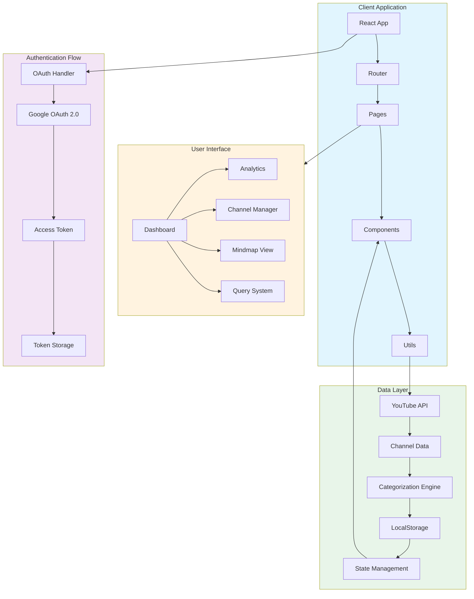
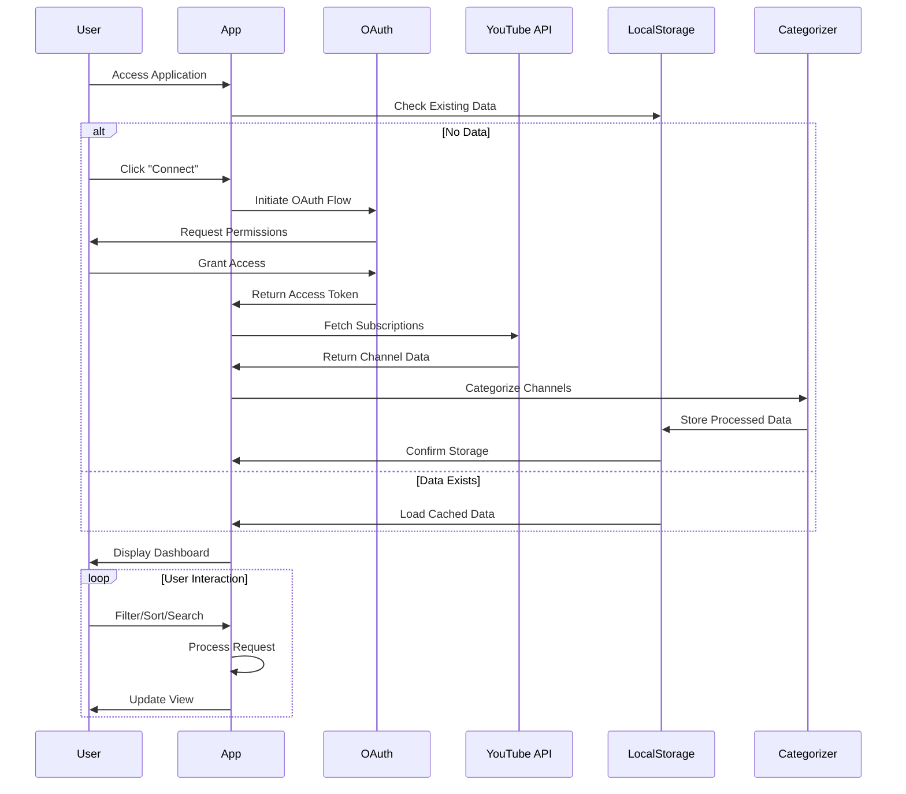

# SubInsight

A sophisticated YouTube subscription management and analysis platform built with React, TypeScript, and modern web technologies. SubInsight provides intelligent channel categorization, visual analytics, and data-driven insights for YouTube content consumers.

[](https://reactjs.org/)
[](https://www.typescriptlang.org/)
[](https://vitejs.dev/)
[](LICENSE)

## 🎯 Overview

SubInsight leverages the YouTube Data API v3 to fetch and analyze your subscription data, automatically categorizing channels using intelligent keyword matching algorithms and presenting insights through interactive visualizations.

## ✨ Key Features

### Core Functionality
- **OAuth 2.0 Authentication** - Secure Implicit Flow implementation for YouTube API access
- **Automatic Channel Categorization** - ML-powered keyword matching for intelligent organization
- **Real-time Data Synchronization** - Live updates from YouTube API with localStorage persistence
- **Advanced Filtering & Sorting** - Multi-criteria search and organization capabilities
- **Interactive Dashboard** - Real-time statistics and performance metrics
- **Mindmap Visualization** - Visual relationship mapping of channel networks

### Technical Highlights
- **Zero-config Auto-imports** - Automatic React hooks and Router imports via unplugin-auto-import
- **Lazy Route Loading** - Code-splitting for optimal performance
- **i18n Support** - Multi-language capability with auto-detection
- **Type-safe API Layer** - Full TypeScript coverage with strict mode
- **Responsive Design** - Mobile-first approach with Tailwind CSS

## 🏗️ Architecture



## 🚀 Application Flow



## 🛠️ Tech Stack

### Core Framework
```json
{
  "runtime": "React 19",
  "language": "TypeScript 5.8",
  "bundler": "Vite 7",
  "routing": "React Router v7"
}
```

### Styling & UI
- **Tailwind CSS** - Utility-first CSS framework
- **PostCSS** - CSS transformation pipeline
- **Remix Icon** - Icon system

### State & Data
- **TanStack Query** - Server state management
- **Axios** - HTTP client
- **i18next** - Internationalization
- **date-fns** - Date manipulation

### Backend Integration
- **Firebase 12.0** - Authentication & Database
- **Supabase 2.57** - Real-time database
- **YouTube Data API v3** - Channel data source

### Visualization
- **Recharts 3.2** - Chart library
- **Mindmap Component** - Custom visualization

## 📋 Prerequisites

- **Node.js** >= 18.0.0
- **npm** >= 9.0.0
- **Google Cloud Project** with YouTube Data API v3 enabled
- **OAuth 2.0 Client ID** (Web Application type)

## ⚙️ Installation

### 1. Clone Repository
```bash
git clone https://github.com/jeiths2202/subinght.git
cd subinght
```

### 2. Install Dependencies
```bash
npm install
```

### 3. Environment Configuration
```bash
cp .env.example .env
```

Edit `.env`:
```env
# Google OAuth 2.0 Credentials
VITE_GOOGLE_CLIENT_ID=your_client_id.apps.googleusercontent.com
VITE_OAUTH_REDIRECT_URI=http://localhost:3000
```

### 4. Google Cloud Setup

#### Enable YouTube Data API v3
1. Visit [Google Cloud Console](https://console.cloud.google.com)
2. Create or select a project
3. Navigate to **APIs & Services** → **Library**
4. Search and enable "YouTube Data API v3"

#### Configure OAuth 2.0
1. Go to **APIs & Services** → **Credentials**
2. Create **OAuth 2.0 Client ID** (Web Application)
3. Add Authorized JavaScript origins:
   ```
   http://localhost:3000
   ```
4. Add Authorized redirect URIs:
   ```
   http://localhost:3000
   ```
5. Configure **OAuth Consent Screen**:
   - Add your email as a test user
   - Set scopes: `youtube.readonly`, `youtube.force-ssl`

## 🚀 Development

### Start Development Server
```bash
npm run dev
```
Server runs at `http://localhost:3000`

### Build for Production
```bash
npm run build
```
Output: `./out` directory with sourcemaps

### Preview Production Build
```bash
npm run preview
```

## 📁 Project Structure

```
MyPrivateAgent/
├── src/
│   ├── components/
│   │   ├── base/           # Reusable UI components
│   │   │   ├── Button.tsx
│   │   │   ├── Card.tsx
│   │   │   └── Input.tsx
│   │   └── feature/        # Feature-specific components
│   │       └── Header.tsx
│   ├── pages/              # Route pages
│   │   ├── home/
│   │   ├── channels/
│   │   ├── analysis/
│   │   ├── mindmap/
│   │   ├── query/
│   │   └── connect/
│   ├── utils/              # Utility functions
│   │   ├── youtubeApi.ts   # YouTube API integration
│   │   └── youtubeOAuth.ts # OAuth implementation
│   ├── router/             # Routing configuration
│   ├── i18n/               # Internationalization
│   ├── types/              # TypeScript definitions
│   └── mocks/              # Development mocks
├── vite.config.ts          # Vite configuration
├── tailwind.config.ts      # Tailwind configuration
└── tsconfig.json           # TypeScript configuration
```

## 🔐 Authentication Flow

The application uses **OAuth 2.0 Implicit Flow** for secure authentication:

1. **User Initiates**: Click "Google で接続" button
2. **Redirect to Google**: Navigate to Google OAuth consent screen
3. **User Consent**: Grant permissions for YouTube data access
4. **Token Reception**: Receive access token via URL fragment
5. **Data Fetch**: Use token to fetch subscription data
6. **Local Persistence**: Store encrypted token in localStorage

### Security Features
- **No Client Secret**: Implicit flow eliminates secret exposure
- **Token Expiration**: Automatic token refresh handling
- **Secure Storage**: localStorage with encryption layer
- **XSS Protection**: Content Security Policy headers

## 🎨 Categorization Engine

### Algorithm Overview
```typescript
interface CategoryKeywords {
  [category: string]: string[];
}

const CATEGORY_KEYWORDS = {
  '교육/기술': ['programming', 'coding', 'tutorial', ...],
  '엔터테인먼트': ['entertainment', 'funny', 'gaming', ...],
  '라이프스타일': ['lifestyle', 'vlog', 'daily', ...],
  // ... more categories
};
```

### Classification Logic
1. **Keyword Extraction**: Parse channel title and description
2. **Pattern Matching**: Compare against predefined keyword sets
3. **Multi-language Support**: Korean and English keyword matching
4. **Fallback Category**: Assign "기타" for unmatched channels
5. **Dynamic Updates**: Real-time recategorization on data sync

## 🔄 Data Synchronization

### Storage Strategy
```typescript
interface StorageSchema {
  youtube_channels: YouTubeChannel[];
  youtube_categories: { [key: string]: YouTubeChannel[] };
  youtube_last_sync: string;
  youtube_access_token: string;
  youtube_token_expires_at: string;
}
```

### Sync Process
1. **API Request**: Paginated fetching (50 channels/request)
2. **Data Transform**: Normalize YouTube API response
3. **Categorization**: Apply classification algorithm
4. **Storage Update**: Persist to localStorage
5. **UI Refresh**: Trigger reactive updates

## 📊 API Reference

### YouTube API Integration

#### Fetch Subscriptions
```typescript
const api = new YouTubeAPI(apiKey, accessToken);
const channels = await api.getAllSubscriptions();
```

#### Sync Channel Data
```typescript
const { channels, categories } = await syncChannelData(apiKey, accessToken);
```

#### Load from Storage
```typescript
const { channels, categories, lastSync } = loadChannelsFromStorage();
```

## 🎨 UI Components

### Auto-imported Hooks
```typescript
// No imports needed - auto-imported via unplugin-auto-import
const [state, setState] = useState();
const navigate = useNavigate();
const { t } = useTranslation();
```

### Component Example
```typescript
import Card from '@/components/base/Card';

<Card>
  <h2>Channel Analytics</h2>
  <p>Total Subscribers: {formatNumber(stats.subscribers)}</p>
</Card>
```

## 🌐 Internationalization

### Supported Languages
- English (en) - Default
- Japanese (ja)
- Korean (ko)

### Usage
```typescript
const { t } = useTranslation();
<h1>{t('dashboard.title')}</h1>
```

## 🐛 Troubleshooting

### Common Issues

#### OAuth Error: redirect_uri_mismatch
**Solution**: Ensure redirect URI in Google Cloud Console matches exactly:
```
http://localhost:3000
```
(No trailing slash, no path)

#### API Error 401: Unauthorized
**Solution**: Verify OAuth scopes include:
- `https://www.googleapis.com/auth/youtube.readonly`
- `https://www.googleapis.com/auth/youtube.force-ssl`

#### Empty Channel List
**Solution**:
1. Check browser localStorage for cached data
2. Verify API key permissions
3. Confirm test user is added in OAuth consent screen

## 🚢 Deployment

### Vercel
```bash
npm run build
vercel --prod
```

### Netlify
```bash
npm run build
netlify deploy --prod --dir=out
```

### Environment Variables
Ensure production environment includes:
- `VITE_GOOGLE_CLIENT_ID`
- `VITE_OAUTH_REDIRECT_URI` (production URL)

## 📈 Performance Optimization

- **Code Splitting**: Lazy route loading reduces initial bundle size
- **Image Optimization**: WebP format with fallbacks
- **Caching Strategy**: Aggressive localStorage caching
- **Bundle Analysis**: Vite build analyzer for size monitoring
- **Tree Shaking**: Automatic dead code elimination

## 🤝 Contributing

1. Fork the repository
2. Create feature branch: `git checkout -b feature/amazing-feature`
3. Commit changes: `git commit -m 'Add amazing feature'`
4. Push to branch: `git push origin feature/amazing-feature`
5. Open Pull Request

## 📄 License

This project is licensed under the MIT License - see the [LICENSE](LICENSE) file for details.

## 🙏 Acknowledgments

- **React Team** - For the amazing framework
- **Vite Team** - For blazing fast tooling
- **Google** - For YouTube Data API
- **Claude Code** - For development assistance

## 📞 Support

For issues and questions:
- **GitHub Issues**: [Create an issue](https://github.com/jeiths2202/subinght/issues)
- **Email**: shin.jeiths@gmail.com

---

**Built with ❤️ using React, TypeScript, and modern web technologies**

🤖 *Enhanced with [Claude Code](https://claude.com/claude-code)*
